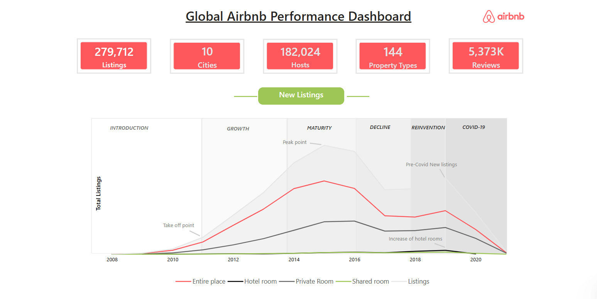
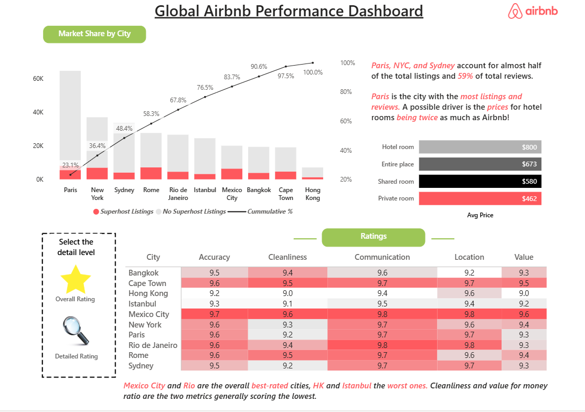
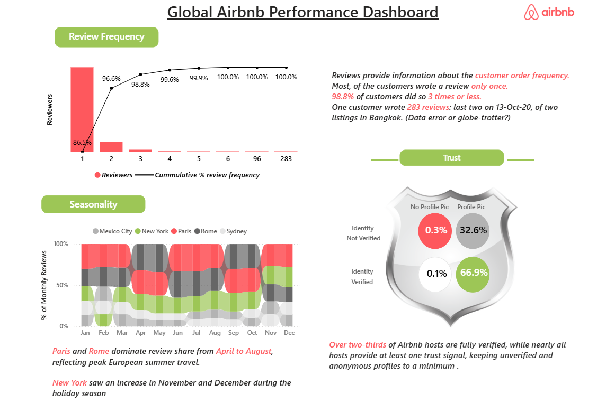

# Global Airbnb Performance Dashboard

End-to-end Power BI dashboard on Global Airbnb Performance covering market share, pricing, ratings, review frequency, seasonality & host trust. Features color-coded visuals, bookmark toggles, Pareto charts & data-driven insights. 279K listings · 182K hosts · 5.37M reviews.

---

## Dashboard Preview

### Overview


### Ratings


### Reviews


---

## Project Summary

| Metric | Value |
|---|---|
| Total Listings | 279,712 |
| Cities | 10 |
| Total Hosts | 182,024 |
| Property Types | 144 |
| Total Reviews | 5,373K |

---

## Dashboard Pages

### Page 1 — New Listings Over Time

Tracks Airbnb's listing growth across six lifecycle phases: Introduction, Growth, Maturity, Decline, Reinvention, and COVID-19. Broken down by room type: Entire place, Private room, Shared room, Hotel room.

**Key Insights:**
- 2015 was the peak year for new listings
- 2016–2017 saw a slowdown due to tightening local regulations
- Airbnb became profitable in H2 2016; 2017 was its first full profitable year
- Growth resumed from 2018 before COVID-19 caused a sharp decline
- Hotel room listings increased notably from 2018 onward

---

### Page 2 — Market Share & Ratings

**Market Share — Pareto Chart**
Superhost vs non-Superhost listings by city with cumulative % line.

**Avg Price by Room Type:**

| Room Type | Avg Price |
|---|---|
| Hotel room | $800 |
| Entire place | $673 |
| Shared room | $580 |
| Private room | $462 |

**Ratings — Bookmark Toggle**
Uses a Power BI bookmark to switch between two views via the "Select the detail level" panel:
- **Overall Rating** (star icon) — Bar chart of average rating per city
- **Detailed Rating** (magnifying glass icon) — Table with per-city scores across Accuracy, Cleanliness, Communication, Location, and Value

| City | Accuracy | Cleanliness | Communication | Location | Value |
|---|---|---|---|---|---|
| Bangkok | 9.5 | 9.4 | 9.6 | 9.2 | 9.3 |
| Cape Town | 9.6 | 9.5 | 9.7 | 9.7 | 9.5 |
| Hong Kong | 9.2 | 9.0 | 9.4 | 9.6 | 9.0 |
| Istanbul | 9.3 | 9.1 | 9.5 | 9.4 | 9.2 |
| Mexico City | 9.7 | 9.6 | 9.8 | 9.8 | 9.6 |
| New York | 9.6 | 9.3 | 9.7 | 9.6 | 9.4 |
| Paris | 9.6 | 9.2 | 9.7 | 9.7 | 9.3 |
| Rio de Janeiro | 9.6 | 9.4 | 9.8 | 9.8 | 9.3 |
| Rome | 9.6 | 9.5 | 9.7 | 9.6 | 9.4 |
| Sydney | 9.5 | 9.2 | 9.7 | 9.7 | 9.3 |

**Key Insights:**
- Paris, NYC, and Sydney account for nearly half of total listings and 59% of total reviews
- Paris leads in both listings and reviews — hotel rooms there cost roughly twice the price of an Airbnb listing
- Mexico City and Rio de Janeiro are the highest-rated cities overall
- Hong Kong (89.7) and Istanbul (91.1) are the lowest-rated
- Cleanliness and Value consistently score the lowest across all cities

---

### Page 3 — Review Frequency, Seasonality & Trust

**Review Frequency — Pareto Chart**

**Key Insights:**
- 86.5% of reviewers wrote only once
- 98.8% of reviewers wrote 3 times or fewer
- One outlier wrote 283 reviews — last two on 13-Oct-2020 for two Bangkok listings (data error or globe-trotter?)

**Seasonality — 100% Stacked Area Chart**
Monthly review share across Paris, Rome, New York, Mexico City, and Sydney.

**Key Insights:**
- Paris and Rome dominate review share from April to August, reflecting peak European summer travel
- New York spikes in November and December during the holiday season

**Trust — Host Verification Matrix**

| | No Profile Pic | Profile Pic |
|---|---|---|
| Identity Not Verified | 0.3% | 32.6% |
| Identity Verified | 0.1% | 66.9% |

**Key Insight:** Over two-thirds of hosts are fully identity-verified with a profile picture. Unverified and anonymous profiles are minimal.

---

## Files

```
├── Global-Airbnb-Performance-Dashboard.pptx    # Presentation deck
├── Airbnb Performance dashboard.pdf            # PDF export of all pages
├── Overview.png                                # Dashboard screenshot - Page 1
├── Ratings.png                                 # Dashboard screenshot - Page 2
├── Reviews.png                                 # Dashboard screenshot - Page 3
├── air bnb logo.png
├── Color Palette.png
├── Dotted Line rectangle.png
├── Magnifying glass.png
├── SHIELD.PNG
├── Star.webp
└── README.md
```

---

## Tools Used

- **Power BI Desktop** — Data modeling, DAX measures, report design
- **Power Query** — Data transformation and shaping
- **Bookmarks** — Toggle between Overall and Detailed rating views

---

## 📊 View Dashboard

🔗 [Click here to view the live dashboard](#) <!-- Replace # with your Power BI publish link -->

## 📥 Download Dataset

🔗 [Download Dataset from Maven Analytics](https://mavenanalytics.io/data-playground/airbnb-listings-reviews)

---

## Author

**Gagan B P** · [databygagan.com](https://databygagan.com) · [GitHub](https://github.com/GaganBP)
